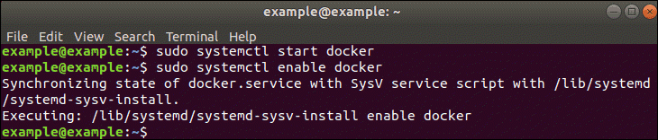

## Setting up docker

In this section you'll learn how to install *__docker__* and *__docker-compose__*.

First things first, open the terminal window.

For different OS the process of installation will differ, so choose the paragraph corresponding to your OS.

#### MAC OS

You are supposed to already have `brew` installed on your PC. To check it, enter the following command:
```
brew -v
```

Then you are need to install everything:
```
brew install docker docker-compose docker-machine xhyve docker-machine-driver-xhyve
```

If you have done it than you’ve received notice that `docker-machine-driver-xhyve` has to run as root, so you have to execute that commands:
```
sudo chown root:wheel $(brew --prefix)/opt/docker-machine-driver-xhyve/bin/docker-machine-driver-xhyve
sudo chmod u+s $(brew --prefix)/opt/docker-machine-driver-xhyve/bin/docker-machine-driver-xhyve
```

On the next step we will create first docker machine using the xhyve driver, to do this, please, enter:
```
docker-machine create default --driver xhyve --xhyve-experimental-nfs-share
```

Then you register a few variables, which will allow you to use default docker machine without typing __default__ each time:
```
eval $(docker-machine env default)
```

#### Linux/Ubuntu

As usual, it’s a good idea to update the local database of software to make sure you’ve got access to the latest revisions.

Therefore, open a terminal window and type:
```
sudo apt-get update
```
Allow the operation to complete.

Next, it’s recommended to uninstall any old Docker software before proceeding.

Use the command:
```
sudo apt-get remove docker docker-engine docker.io
```

To install Docker on Ubuntu, in the terminal window enter the command:
```
sudo apt install docker.io
```

The Docker service needs to be setup to run at startup. To do so, type in each command followed by enter:
```
sudo systemctl start docker
```
```
sudo systemctl enable docker
```


To check if __docker__ and __docker-compose__ are actually installed, please, enter:
```
docker -v
docker-compose -v
```

Voilà, you ready to move on!

#### Dockerfile Configuration

Here it is better to specify two Dockerfiles for backend and frontend parts.

_Note_: we use **Nginx** as a web-server.

First of all, we need to specify `nginx.conf` file, where the configuration of web-server will be described.
Here is the example based on rails app:

```
upstream rails_app {
    server web:3000;
}

server {
    # define your domain
    server_name _;
    # define the public application root
    root   /app/public;
    index  index.html;
    # define where Nginx should write its logs
    # access_log /app/log/nginx.access.log;
    # error_log /app/log/nginx.error.log;

    # deny requests for files that should never be accessed
    location ~ /\. {
        deny all;
    }

    location ~* ^.+\.(rb|log)$ {
        deny all;
    }

    # serve static (compiled) assets directly if they exist (for rails production)
    location ~ ^/(assets|images|javascripts|stylesheets|swfs|system)/   {
        try_files $uri @rails;
        access_log off;
        gzip_static on;
        # to serve pre-gzipped version
        # expires max;
        # add_header Cache-Control public;

        # add_header Last-Modified "";
        # add_header ETag "";
        break;
    }

    # send non-static file requests to the app server
    location / {
        try_files $uri "${uri}index.html" @rails;
    }

    location @rails {
        proxy_set_header  X-Real-IP  $remote_addr;
        proxy_set_header  X-Forwarded-For $proxy_add_x_forwarded_for;
        proxy_set_header Host $http_host;
        proxy_redirect off;
        proxy_pass http://rails_app;
    }
}
```

Then, let's have a look at the configuration of `Dockerfile.nginx`:

```
FROM node:12-alpine as node

RUN mkdir /app
WORKDIR /app
COPY ./<directory with front part>/package.json /app
COPY ./<directory with front part>/package-lock.json /app
RUN npm i
COPY ./<directory with front part> /app
RUN npm run build

FROM nginx:1.17.5
COPY nginx.conf /etc/nginx/conf.d/default.conf

COPY --from=node /app/dist /app/public
```

Below you can find the `Dockerfile` with configuration process of backend part based on Rails.

```
FROM ruby:2.6.3

RUN apt-get update -qq && apt-get install -y build-essential libpq-dev cron
RUN curl -sL https://deb.nodesource.com/setup_10.x | bash -
RUN apt-get install -y nodejs
RUN npm install -g yarn
RUN mkdir /app
WORKDIR /app

COPY Gemfile /app/Gemfile
COPY Gemfile.lock /app/Gemfile.lock
RUN bundle install
COPY . /app

RUN bundle exec whenever --update-crontab

COPY scripts/entrypoint.sh /usr/bin/
RUN chmod +x /usr/bin/entrypoint.sh
ENTRYPOINT ["entrypoint.sh"]
```

Also, at this step we need to specify `docker-compose.yml` file.
The Compose file is a YAML file defining services, networks and volumes.

In _environment_ section of each service you should set up all the environment variables that are used in your application
(their values will be set on **Gitlab CI** and will automatically be loaded during build stage).

_Note_: here we use _*sidekiq*_ and _*redis*_ for background jobs, so configure these services if you only need them.

```
version: '3'

services:
  db:
    image: postgres
    volumes:
      - /var/lib/postgresql
    ports:
      - 5432:5432

  web:
    build: .
    command: bash -c "cron && bundle exec rails s -p 3000 -b '0.0.0.0'"
    environment:
      - GMAIL_OWNER
      - GMAIL_PASSWORD
      - SMTP_DOMAIN
      - SMTP_ADDRESS
      - SMTP_PORT
      - RAILS_ENV
      - RACK_ENV
      - REDIS_URL
      - RAILS_SERVE_STATIC_FILES
      - RAILS_LOG_TO_STDOUT
      - DATABASE_PASSWORD
      - APP_HOST
    volumes:
      - .:/app
    links:
      - db
      - redis

  nginx:
    build:
      context: .
      dockerfile: Dockerfile.nginx
    ports:
      - 80:80
    links:
      - web

  redis:
    image: redis:5.0-alpine
    command: redis-server --appendonly yes
    environment:
      - ALLOW_EMPTY_PASSWORD=yes
    volumes:
      - redis:/data

  sidekiq:
    build: .
    environment:
      - REDIS_URL
    links:
      - redis
    command: bash -c "bundle exec sidekiq -c 2"

volumes:
  redis:
  postgres:
```

If you want to use this docker on *__Gitlab CI/CD__*, add image name on `web`, `sidekiq`, `nginx`

Example:

```
web:
    image: "${CI_REGISTRY_IMAGE-local}/app:${CI_COMMIT_SHORT_SHA-local}"
...
nginx:
    image: "${CI_REGISTRY_IMAGE-local}/nginx:${CI_COMMIT_SHORT_SHA-local}"
...
sidekiq:
    image: "${CI_REGISTRY_IMAGE-local}/sidekiq:${CI_COMMIT_SHORT_SHA-local}"

```
